# Dream Vacations Web App
## Overview
 This application allows users to create a list of countries they'd like to visit, providing basic information about each country. The project is structured to mimic a real-life production environment, employing best practices in software development, deployment, and continuous integration/continuous delivery (CI/CD).

**Live demo:** https://16.170.179.141.sslip.io

A full-stack travel app where users add dream vacation destinations by country name. The app looks up the capital, population and region from the REST Countries API and stores them in PostgreSQL. This repository covers the whole DevOps lifecycle for it: Git workflow, shell scripts, Docker, Docker Compose, CI/CD with GitHub Actions, Terraform on AWS, and Nginx with HTTPS.

## Tech stack

| Layer | Tool |
|---|---|
| Frontend | React (built to static files, served by Nginx in a container) |
| Backend | Node.js, Express |
| Database | PostgreSQL 16 (official `postgres:16-alpine` image) |
| Containers | Docker, Docker Compose |
| CI/CD | GitHub Actions, Docker Hub |
| Infrastructure | Terraform, AWS (VPC, EC2, Elastic IP, Route 53, S3, DynamoDB) |
| Web server and TLS | Nginx reverse proxy, Let's Encrypt via Certbot |

## Architecture

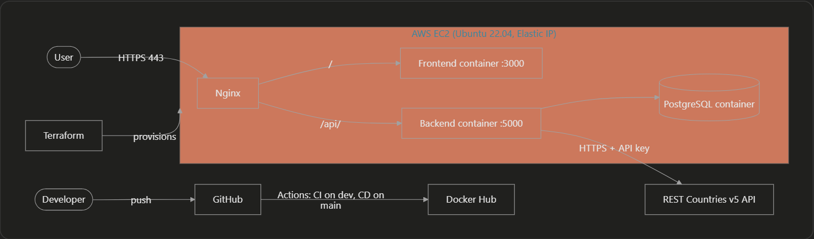

## Features
- **Add Countries**: Users can add countries to their dream vacation list.
- **View Country Details**: Displays capital, population, and region information for each country.
- **Remove Countries**: Users can remove countries from their list.
- **Production-Ready Setup**: The project is designed to be scalable and maintainable, following industry-standard practices for deployment and CI/CD.

## Repository structure

```
.
├── backend/                 Node/Express API and Dockerfile
├── frontend/                React app, Dockerfile, container nginx.conf
├── db/init.sql              Creates the destinations table on first start
├── docker-compose.yml       Runs frontend, backend and database
├── scripts/                 setup-env.sh, backup-db.sh, log-rotate.sh
├── nginx/                   Host Nginx reverse proxy config
├── infra/                   Terraform configuration
├── bootstrap-tf-backend.sh  Creates the S3 bucket and DynamoDB table for Terraform state
└── .github/workflows/       ci.yml and cd.yml
```

## Git workflow

- `dev` is the working branch. All changes are committed there.
- `main` holds tested, deployable code and is updated through a pull request from `dev` after each completed phase.
- CI runs on every push to `dev` and on every pull request into `dev` or `main`.
- CD runs when `main` is updated.

## Run it locally

Prerequisites: Docker with Docker Compose, and a free API key from https://restcountries.com (the app calls the v5 API, which requires one).

1. Clone the repository:
   ```bash
   https://github.com/obusorezekiel/Dream-Vacation-App 
   cd dream-vacations-app
   ```
2. Create a `.env` file in the repository root:
   ```
   DB_USER=dvuser
   DB_PASSWORD=choose_a_password
   DB_NAME=dreamvacations
   BACKEND_PORT=5000
   FRONTEND_PORT=3000
   COUNTRIES_API_KEY=your_restcountries_key
   ```
   `.env` is gitignored. `.env.example` shows the shape.
3. In `docker-compose.yml`, set the frontend build arg `REACT_APP_API_URL` to `http://localhost:5000`. The committed value is the production URL. Create React App bakes this value in at build time, so changing it requires a rebuild.
4. Start everything with one command:
   ```bash
   docker compose up -d --build
   ```
5. Open http://localhost:3000, or check the API with `curl localhost:5000/api/destinations`.

Stop with `docker compose down`. Add `-v` to also delete the database volume.

## Shell scripts

All scripts are in `scripts/`, use `set -euo pipefail`, and can be re-run safely.

| Script | Purpose |
|---|---|
| `setup-env.sh` | Installs Docker, Docker Compose and Node.js if they are missing |
| `backup-db.sh` | Dumps the database with `pg_dump`, compresses it, and keeps the last 7 backups |
| `log-rotate.sh` | Deletes logs older than 14 days and compresses large ones |

Make them executable with `chmod +x scripts/*.sh`. A `.gitattributes` file forces LF line endings on `*.sh` so Windows editors cannot break them on Linux.

## CI/CD (GitHub Actions)

- **CI** (`.github/workflows/ci.yml`): installs dependencies, lints, tests, and builds the backend and frontend.
- **CD** (`.github/workflows/cd.yml`): builds both Docker images and pushes them to Docker Hub as `solaroyal/dv-backend` and `solaroyal/dv-frontend`. It can also be started manually from the Actions tab.

Repository secrets required: `DOCKERHUB_USERNAME`, `DOCKERHUB_TOKEN`, `REACT_APP_API_URL`.


## Roadmap
- **CI/CD Implementation**: Automate the build, test, and deployment process using industry-standard CI/CD tools.
- **Infrastructure as Code (IaC)**: Implement IaC for automated environment setup and management.
- **Scalability**: Enhance the application to support multiple environments (staging, production) with proper domain names and configurations.
- **Security**: Utilize Kubernetes Secrets and environment variables for secure data management.
- **Microservices**: Modularize the application into microservices to improve maintainability and scalability.

## Infrastructure (Terraform)

Everything is in `infra/`. It creates:

- VPC (`10.1.0.0/16`), public subnet, internet gateway, route table and association
- Security group allowing SSH (22), HTTP (80) and HTTPS (443)
- Route 53 hosted zone for `dreamvacations-sola.com`
- EC2 instance (t3.micro, Ubuntu 22.04), SSH key pair, and an Elastic IP so the address survives restarts

State is stored remotely in S3 with DynamoDB locking.

```bash
./bootstrap-tf-backend.sh        # one time: creates the state bucket and lock table
cd infra
cp terraform.tfvars.example terraform.tfvars   # then fill in the values
terraform init
terraform plan
terraform apply
```

`terraform.tfvars` is gitignored. Outputs include the Elastic IP, VPC and subnet IDs, security group ID, and the Route 53 nameservers.

## Deployment on AWS

1. `terraform apply` creates the server.
2. SSH in: `ssh -i ~/.ssh/<key> ubuntu@<elastic-ip>`.
3. Clone this repository, run `scripts/setup-env.sh`, add your user to the `docker` group.
4. Create the `.env` file as in the local setup, with `REACT_APP_API_URL` set to the public HTTPS URL.
5. Run `docker compose up -d --build`.

## Domain, Nginx and HTTPS

The site is served at `https://16.170.179.141.sslip.io`. sslip.io is a free DNS service that resolves a hostname containing an IP address to that IP, so no domain purchase was needed, and Let's Encrypt can issue a real certificate for it.

The Route 53 hosted zone for `dreamvacations-sola.com` is provisioned by Terraform, but that domain was not registered, so its nameservers are not delegated to AWS and the zone does not serve live traffic. Pointing a registered domain at Route 53 only needs the registrar's nameservers changed to the zone's nameservers and an A record pointing to the Elastic IP.

Nginx on the server (`nginx/dream-vacations.conf`) sends `/` to the frontend container and `/api/` to the backend container. Certbot issued the certificate and added the HTTP-to-HTTPS redirect:

```bash
sudo certbot --nginx -d 16.170.179.141.sslip.io
sudo certbot renew --dry-run     # confirms auto-renewal works
systemctl list-timers | grep certbot
```

## Security notes

- Secrets live only in `.env` files and GitHub secrets. A pre-commit hook and `.gitignore` block `.env` files from being committed.
- SSH on the server is open to all addresses (key-only login) because the developer's IP changes often. Restrict the `my_ip` variable in `terraform.tfvars` to a single address for any longer-lived deployment.
- Only ports 80 and 443 are public. The container ports 3000 and 5000 are reached only through Nginx.

## Problems solved along the way

- **React build failed on Node 20** (`ERR_OSSL_EVP_UNSUPPORTED`): older `react-scripts` needs `NODE_OPTIONS=--openssl-legacy-provider` during the build.
- **REST Countries v3.1 was deprecated:** migrated the backend to the v5 API, which needs an API key and returns a different response shape.
- **Frontend called the wrong backend:** `REACT_APP_*` values are baked in at build time, so the URL is passed as a Docker build argument.
- **Shell scripts failed on Linux:** Windows CRLF line endings broke `set -euo pipefail`. Fixed with `dos2unix` and `.gitattributes`.
- **`.env` files were committed by mistake:** removed from tracking, `.gitignore` fixed, secrets rotated.
- **Server IP changed after a restart:** attached an Elastic IP through Terraform.


## Future improvements

- CloudWatch logs and alarms
- Terraform `user_data` so a replaced server configures itself
- Automatic deployment from CD to the server
- Register a real domain and delegate it to Route 53


## Best Practices
- **Version Control**: All changes are tracked in Git for collaboration and history management.
- **Environment Management**: Separate configurations for different environments (development, staging, production) using environment variables.
- **Security**: Sensitive information is managed using environment variables and Kubernetes Secrets.
- **Documentation**: The project is well-documented to facilitate onboarding and maintenance.


## Deployments
## Live Demo

## CI/CD Status


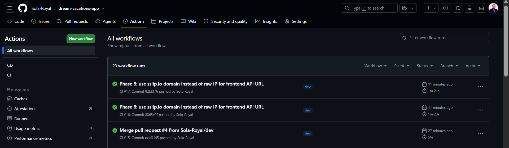

## The vpc provissioned
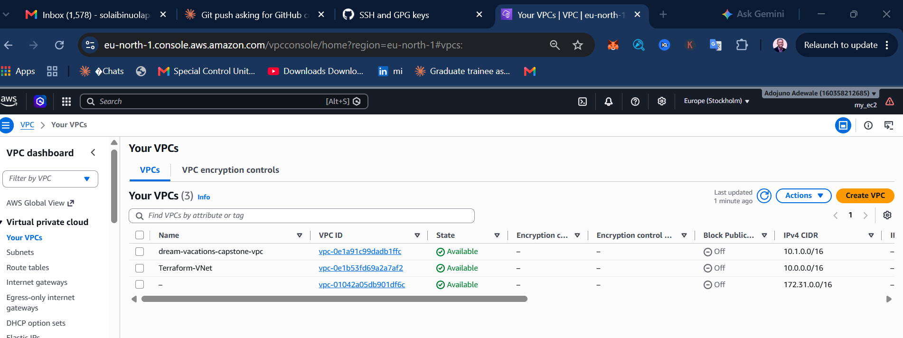

## The route 53 : dreamvacations-sola.com
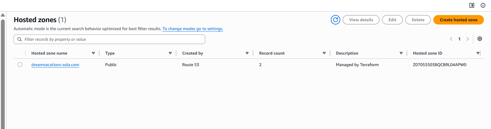


## EC2 lauched from terminal
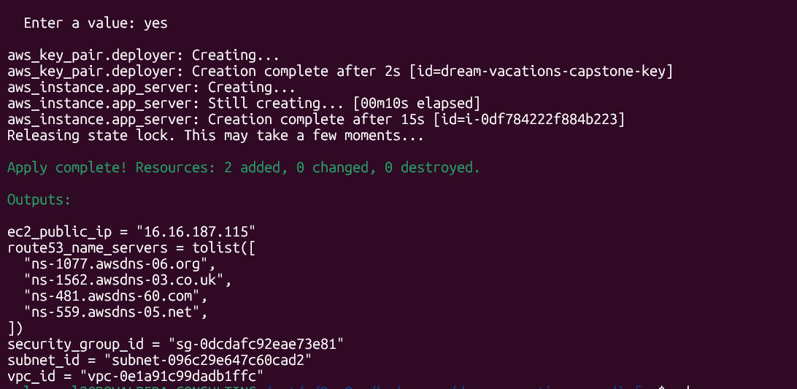

## Ec2 on aws console
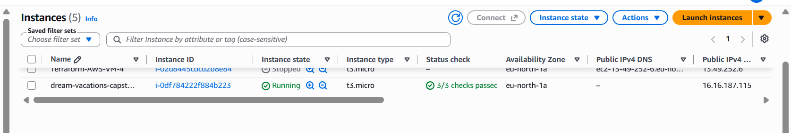


## ssh in to my ec2
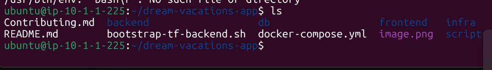
Application running successfully
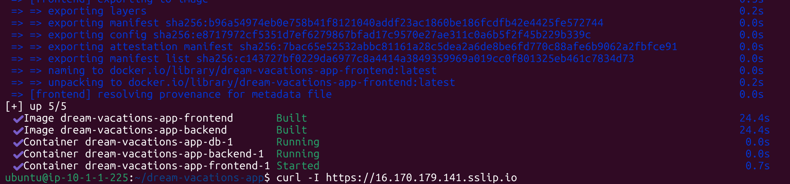
## My inbound rules
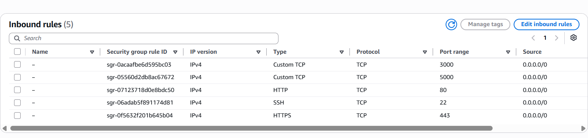

**Live demo:** https://16.170.179.141.sslip.io
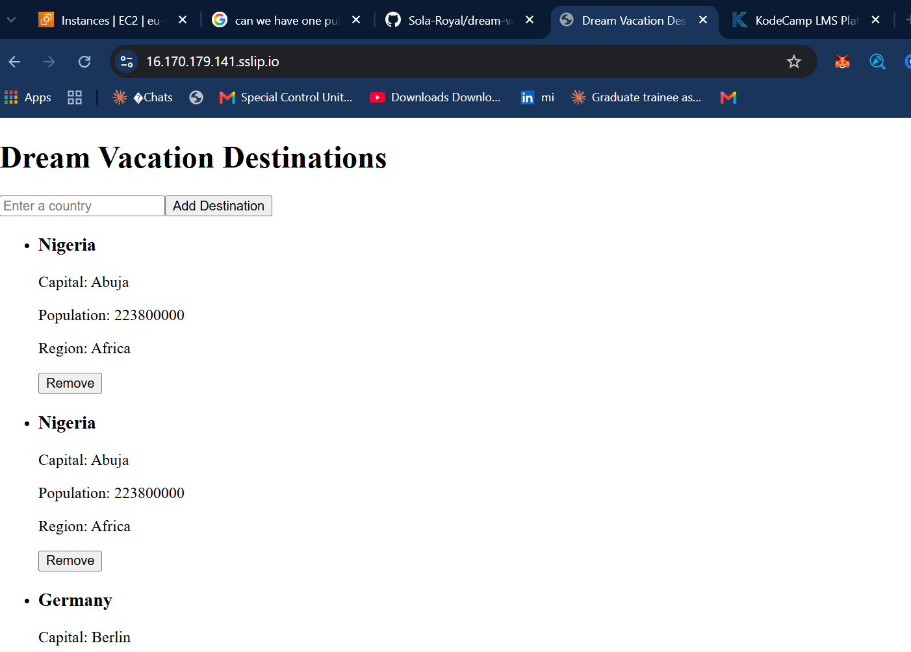

## Api response in UI
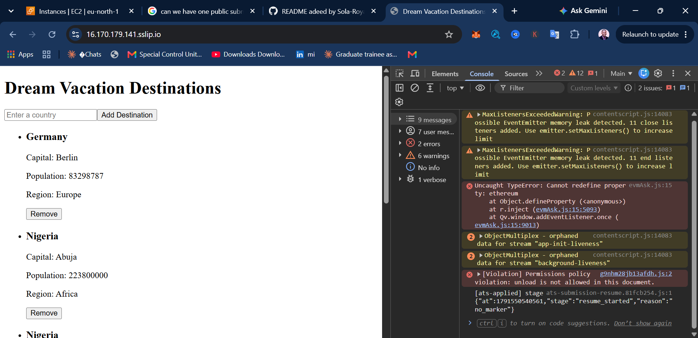